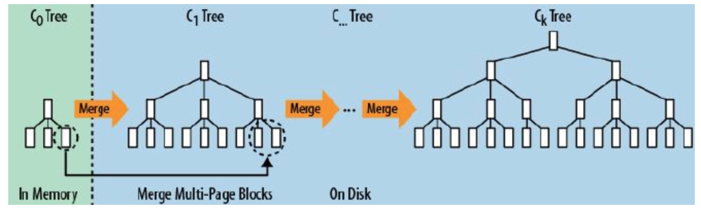
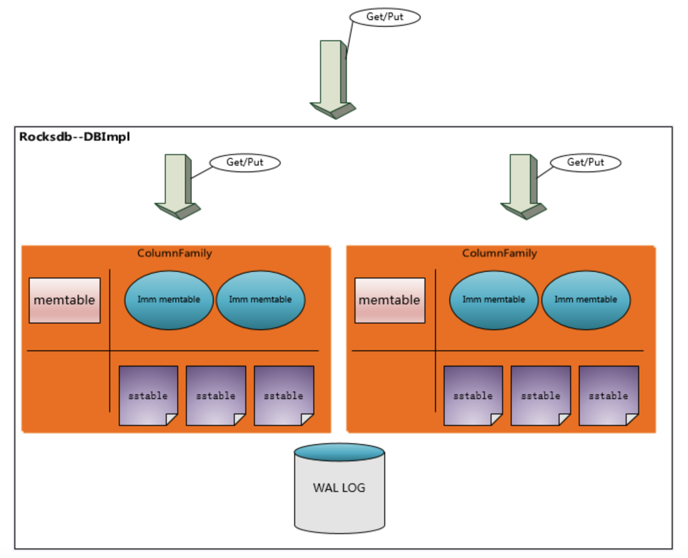

## RocksDB 简单介绍
当前 CITA 使用 RocksDB 作为其底层存储的数据库。
RocksBD 采用的是 LSM-Tree(Log-Structured-Merge-Tree), 如下图所示：

LSM 树的设计思想非常简单，它的原理是把一颗大树拆分成 N 棵小树，它首先写入到内存中（内存没有寻道速度的问题，随机写的性能得到大幅提升），
在内存中构建一颗有序小树，随着小树越来越大，内存的小树会 flush 到磁盘上。磁盘中的树定期可以做 merge 操作，合并成一棵大树。
 
RocksDB 的三种基本文件格式是 memtable/sstfile/logfile，memtable 是一种内存文件数据系统，新写数据会被写进 memtable，部分请求内容会被写进 logfile。
logfile 是一种有利于顺序写的文件系统。memtable 的内存空间被填满之后，会有一部分老数据被转移到 sstfile 里面，这些数据对应的 logfile 里的 log 就会被安全删除。
sstfile 中的内容是有序的。

上图所示，所有 Column Family 共享一个 WAL 文件，但是每个 Column Family 有自己单独的 memtable & ssttable(sstfile)，即 log 共享而数据分离。

在下面这几种条件下 RocksDB 会 flush memtable 到磁盘.

1. 当某一个 memtable 的大小超过 write_buffer_size.
2. 当总的 memtable 的大小超过 db_write_buffer_size.
3. 当 WAL 文件的大小超过 max_total_wal_size 之后.

## 参数配置及相关配置

### Columns
CITA 总共创建了 7 个 columns, 分别在 Executor 与 Chain 微服务中使用。它们分别是：
* COL_STATE
* COL_HEADERS
* COL_BODIES
* COL_EXTRA
* COL_TRACE
* COL_ACCOUNT_BLOOM
* COL_NODE_INFO

### 数据库配置
* columns : 7 (COLUMNS)
* cache_sizes : 2 M for each column
* max_open_files : 512
* compaction (default as ssd ): 
    * initial_file_size : 64 * 1024 * 1024
    * file_size_multiplier : 1
    * write_rate_limit : None

* wal : true

### 其它选项
* see rocksdb_options_create for default options
* max_total_wal_size : 64 * 1024 * 1024
* verify_checksums_in_compaction : 0
* create_if_missing : true
* use_fsync : false
* db_write_buffer_size : 4 * 64 * 1024 * 1024
* max_background_flushes : 2
* max_background_compactions : 2
* compaction_style : DBLevelCompaction
* target_file_size_base : 64 * 1024 * 1024
* target_file_size_multiplier : 1

### Column 选项
* compaction_style : DBLevelCompaction
* target_file_size_base : 64 * 1024 * 1024
* target_file_size_multiplier : 1
* db_write_buffer_size : 4 * 64 * 1024 * 1024
* block_opts.cache : 2 * 1024 * 1024

## 关键配置说明

在说明配置之前先简单介绍一下 RocksDB。

* max_total_wal_size

wal 的最大空间，CITA 设置为 64M。

* db_write_buffer_size

最大的 DB 写 buffer，即所有 Column 使用的写 buffer 不大于 256M。

* write_buffer_size

这个配置项 CITA 没有特殊配置，使用的是默认值 64M。在执行过程中每个 column 有两个。

* max_background_flushes

最大的 flushes 线程。

* max_background_compactions

最大的压缩线程，线程不宜过多，过多容易导致写请求被 hang 住。
