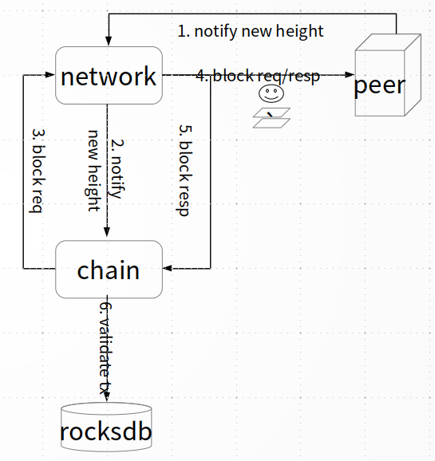
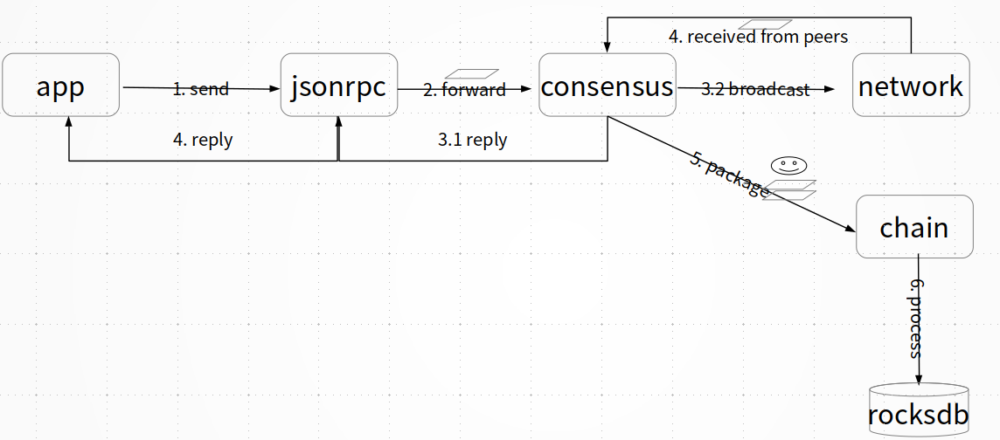

# 交易处理

## 交易验证

CITA中交易通过消息总线进行转发，用户通过RPC模块和系统进行交互。RPC请求分为两种，一种是对链上状态进行查询的请求，一种是需要打包到区块中的交易。

首先在RPC模块，对用户请求进行验证：

* 是否符合服务规范（目前支持JSON-RPC 2.0）;
* 服务API方法是否合法；
* 参数个数和格式是否合法。

如果验证通过，则根据请求类型发往不同模块。对于查询请求，发送到链模块，链模块解析请求，并执行然后返回结果。对于交易，则发送到共识模块，共识模块最终形成共识后，发送到链模块，链模块的验证如下：

* 验证区块格式是否正确

  * PreHash是否正确；
  * 区块签名是否正确；
  * 签名个数是否满足。

* 执行交易时，需要验证

  * 交易签名是否合法；
  * 是否拥有权限；
  * 发送人是否有足够的配额；
  * 交易是否为重复交易。

交易验证成功则正常执行，验证失败则将错误信息，保持在交易回执中。CITA中交易处理具有原子性，当交易在执行过程中发生错误，整个交易状态会回滚。

## 交易执行

对于查询请求，用户通过RPC模块进行请求，首先对交易格式进行验证，验证成功后发送到链／网络模块，验证失败则直接返回失败结果；链／网络模块收到请求之后，进行查询，再将结果返回给RPC模块；最后，RPC将结果返回给用户。

对于交易，RPC模块收到交易请求，首先对交易的格式进行验证，验证成功后发送给共识模块；共识模块首先将交易保存在交易池中，待共识出块时从交易池中获取交易，共识完成后将包含交易的区块发送给链模块。
对于从其他节点收到的交易，通过Network收到后，发送给共识模块，共识模块做相同的处理。

链模块收到共识后的区块之后，首先对区块合法性做必要的验证，验证通过后执行交易并将执行结果存储到本地；待区块内所有的交易执行完成后，将区块、交易、修改状态、交易回执等持久化到数据库中；最后链模块更新状态，并通知共识模块。

## 异步交易处理

区块链节点的最主要职责包括点对点网络交互、共识、交易处理以及数据存储四个方面。节点通过共识算法，在系统中形成对交易排序的全局共识，再按照共识
后的顺序对交易进行逐个处理。只要处理过程能保证确定性，所有节点最后都能达到一致的状态，产生相同的本地数据。

在当前的区块链设计中，共识与交易处理耦合程度较高，共识的性能受到交易处理能力的影响。
CITA将共识与交易处理解耦为独立的微服务，共识服务只负责交易排序，并不关心交易内容，交易处理服务只负责对排好顺序的交易进行处理。
此时共识过程可以先于交易处理完成，交易处理服务可以异步执行。异步交易处理技术不仅使CITA具有更好的共识性能，还带来了更有弹性的交易处理能力，
交易负荷可以被更均匀的分摊到一段时间内。

由于交易异步处理，在共识前只能对交易进行有限的检查，例如签名验证。无效的交易有可能通过共识进入交易处理服务，产生一定程度的垃圾数据。
在有必要的情况下，可以通过CITA的交易控制或者垃圾清理技术解决该问题。
